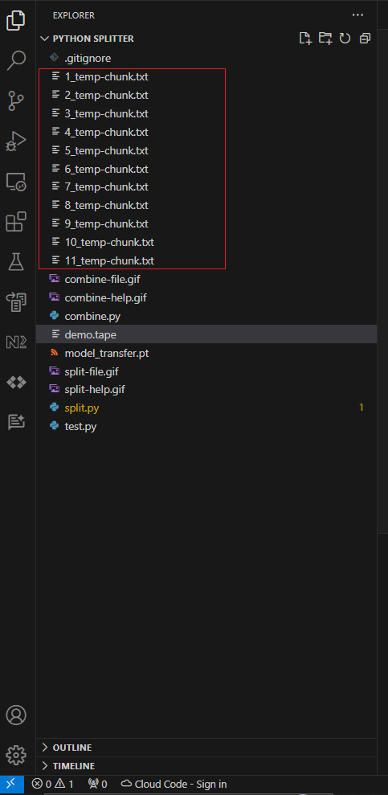
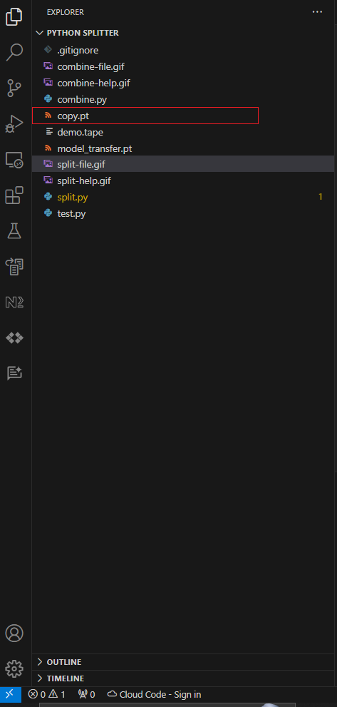

# CLI File Splitter
This simple, two file scripts allow you to split a file when needed and combine a series of chunks back together.

#Installation 
The two scripts rely on the library `alive_progress` 
install it before using the scripts:
```
pip install alive_progress
```
##User Guide

###Split
Both scripts have a `--help` flag that shows you the options what that they do.

These are options for the split script:


To split a file, you need to name the file you want split and the byte size per chunk.

You can choose the size in bytes, kilo, mega or giga bytes.




You also have the option to name the chunks with the `--filename-chunks` flag

###Combine
to combine the file back into one, use the combine script.
These are the options:


You need to provide the filename, the number of expected chunks you are going to combine and the file extention.

If the chunks were given a non default name, you also need to use the `--filename-chunks` flag to name non default chunks name.




To insure that both files are the same, use the command `fc` for windows 


or the `diff` command in linux.


